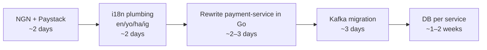

All five are doable, and most are genuinely good ideas. But they range from a 1-day job to a 1-month rewrite, and a couple have gotchas worth knowing before you commit. Here's my honest take, one by one.

## 1) Paystack ✅ Strong yes

Paystack is the right pick for an NGN-denominated demo. You'd already noted payment-service is dead code — wiring it to Paystack kills two birds.

**What it looks like:**
- Sign up at paystack.com → grab `PAYSTACK_SECRET_KEY` + `PAYSTACK_PUBLIC_KEY` (test mode is free, fake cards provided).
- Two flows are common, pick one:
  - **Inline checkout** (recommended for SPAs): frontend opens Paystack popup with the public key → on success, frontend posts the `reference` to your payment-service → payment-service calls `GET https://api.paystack.co/transaction/verify/{reference}` → if `status === 'success'`, mark order paid, publish `payment.completed`.
  - **Redirect**: payment-service calls `POST /transaction/initialize`, returns the `authorization_url`, frontend redirects there, Paystack redirects back to a callback route.
- **Always** add a webhook endpoint (`POST /api/payments/webhook`) for `charge.success` — verify the `x-paystack-signature` HMAC. Don't rely on the frontend telling you "it worked".

**Gotcha:** Paystack takes amounts in **kobo** (₦1 = 100 kobo). `amount: 250000` means ₦2,500. Easy to forget and overcharge by 100×.

**Effort:** ~1 day including the webhook + a real end-to-end test.

## 2) USD → NGN ✅ Easy, do it together with Paystack

Cosmetic + minor — the DB column `DECIMAL(10,2)` works fine for NGN.

**Files that matter:**
- Every `$` symbol and `toLocaleString('en-US', { currency: 'USD' })` in the frontend → `'en-NG'` + `'NGN'` (renders as `₦`).
- Realistic NGN seed prices (e.g. ₦15,000 instead of $25).
- Tax 8% → **VAT 7.5%** (Nigerian standard).
- Free-shipping threshold `> $50` → e.g. `> ₦50,000`.
- Email templates that mention currency.

**Effort:** 2–3 hours. Should be done in the same PR as Paystack so you never have a half-converted state.

## 3) i18n — en / yo / ha / ig ⚠️ Yes but bigger than it looks

Technically straightforward. The *translation work* is the real cost.

**Stack I'd pick:** `next-intl` for the Next.js 15 App Router (it has first-class support for locale segments like `/yo/products`). Alternatives: `react-i18next` (works but more setup with the App Router).

**What's involved:**
- Extract every visible English string in the frontend to `messages/en.json`, `yo.json`, `ha.json`, `ig.json`.
- Wrap the app in `NextIntlClientProvider`, add a `[locale]` route segment.
- Add a language switcher in the header (next to the theme toggle).
- Store user's locale preference on the `users` row → backend uses it when sending emails (the email templates also need YO/HA/IG translations).
- Numbers/currency localize automatically via `Intl` — `₦15,000.00` will render correctly in all four locales.

**Real honest opinion:** Yoruba/Hausa/Igbo deserve **human translations**, not ChatGPT or Google Translate. A real Yoruba speaker will spot bad tones instantly (`ó`/`ò` matter). For an open-source demo this is fine to do imperfectly; if it's user-facing, find a native speaker per language. Otherwise you'll get well-meaning corrections forever.

**Effort:** 1–2 days for the plumbing + a *long tail* of translation polish.

## 4) Rewrite Node services in Go / Java ✅ Great for learning, do it carefully

This is excellent resume / learning material. Two rules to make it painless:

1. **Pick isolated services.** Avoid anything that imports `services/shared/*` heavily unless you're prepared to port the shim too. Good candidates ranked:
   - **payment-service → Go** (best fit — natural for high-throughput HTTP, official `paystack-go` clients exist, single responsibility, no other service depends on its internals — only on the events it publishes).
   - **inventory-service → Go** (HTTP + RabbitMQ consumer + Postgres — small, isolated).
   - **auth-service → Java/Spring Boot** (classic showcase: JWT, Spring Security, bcrypt, password reset flow — but it's the most critical service, so test thoroughly).
   - **search-service → Java/Spring Boot** (Elasticsearch's Java client is the most mature; Spring Data Elasticsearch is well-trodden).
2. **Preserve the contract.** Same REST paths, same JSON shapes, same RabbitMQ routing keys + payload schemas. The api-gateway and other services don't need to know.

**Watch out for:**
- Your `services/shared/eventBus.js` and `services/shared/logger.js` would need a Go or Java twin (with the same exchange/queue names and the same log JSON format so Loki/Promtail still works).
- Java services start slowly in Docker — your `depends_on: condition: service_healthy` checks may need longer `start_period`.
- Different language → different Dockerfile patterns. Use multi-stage builds.

**My pick for max learning vs effort:** rewrite **payment-service in Go**. It's the same one we'd touch for Paystack anyway, it's tiny, nothing depends on its internals, and Go's strict typing + `net/http` + `database/sql` covers most idioms you want to learn.

**Effort per service:** Go ~2–3 days, Java/Spring Boot ~3–5 days (more boilerplate).

## 5) Database per service ⚠️ The biggest job — and the highest-value one

This is **the** canonical microservices pattern, and the single biggest architectural upgrade in your list. It's also more work than the other four combined. Here's why.

**The benefit is real:**
- True service isolation — no more cross-service `JOIN`s like server.js.
- The delete-user FK cleanup we just did goes away — each service deletes its own rows on a `user.deleted` event.
- Each team can choose its own schema, version it, scale and back it up independently.
- Demonstrates you actually understand microservices (a lot of "microservice" apps fail this exact test).

**The cost is also real:**
- **No cross-service queries.** Today the admin dashboard does `SELECT COUNT(*) FROM users; SELECT SUM(total) FROM orders;` in one DB. After the split, that becomes service-to-service HTTP calls, or a *read model* built from events.
- **Data duplication.** order-service will need to cache enough user info (id, email, name) to render an order list — because it can't `JOIN users` anymore.
- **Cleanup becomes event-driven.** Emit `user.deleted` → notification, order, review, cart, etc. all listen and delete their own rows. The trade-off: cleanup is now eventually consistent.
- **Migrations get harder.** Today: one schema.sql. After: one migration tool per service.

**My recommendation on the engine mix.** You asked about Postgres + MySQL + Mongo. Honestly, MySQL doesn't earn its keep here — there's nothing in LuxeCart that fits MySQL better than Postgres. If you want **three** stores for variety, this is more truthful to the domain:

| Service | Store | Why |
|---|---|---|
| auth, user, order, payment, admin | **Postgres** (one per service) | ACID, FKs within the service, rich queries |
| cart | **Redis** (primary, not just cache) | Carts are ephemeral key/value — perfect Redis fit |
| notification, email-log, review | **MongoDB** | Document-shaped; you already use it for emails |
| product | **Postgres + Elasticsearch** | Postgres is source of truth, ES for search (which you already have) |
| inventory | **Postgres** of its own | Needs transactions |

If MySQL is non-negotiable (e.g. you really want to learn it), put **one** service on it — `review-service` is a reasonable candidate. But it's a learning-driven choice, not a domain-driven one.

**Effort:** 1–2 weeks if you do it properly with data migration scripts, event-driven cleanup, and read models. This is also where Kafka would start to pay off (replay event stream to seed new per-service read models), so it's worth doing **after** any Kafka work, not before.

---

## What I'd actually recommend (order of operations)

Reasoning for the order:
- **NGN + Paystack first.** They go together, fix the dead payment-service, and immediately make the app feel real for a Nigerian audience.
- **i18n second.** Adding it after the currency change means you only touch every string once (currency formatting is part of i18n).
- **Go rewrite third.** Do it on payment-service while the Paystack code is fresh in your head — you'll consolidate the learning.
- **Kafka before DB-per-service**, because per-service DBs leans heavily on events for cross-service consistency, and Kafka's replay is exactly what you want when seeding a brand-new isolated DB from history.
- **DB-per-service last.** Biggest, most disruptive change — best done when everything else is stable and you have a real event backbone.

If you want to keep momentum without committing to the whole roadmap, the cheapest, highest-impact next step is **NGN + Paystack together** (one PR, ~2 days, instantly visible). Want me to start there when you're ready, or are there more questions first?