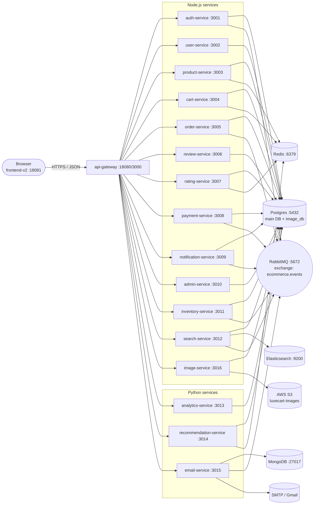

Read [](file:///home/princewillopah/DevOps/LuxeCartV2/docker-compose.yml#1-1), lines 1 to 400

Read [](file:///home/princewillopah/DevOps/LuxeCartV2/docker-compose.yml#400-400), lines 400 to 589

I have everything I need. Here's the full map.

# LuxeCart system map

## How everything is wired (high level)



## The infrastructure (shared backing services)

| Component | Host port | What it holds | Used by |
|---|---|---|---|
| **postgres** :5432 | 5432 | Main DB (`users, products, orders, order_items, reviews, ratings, payments, notifications, wishlists, auth_tokens`) + a second DB `image_db` for image metadata | auth, user, product, cart, order, review, rating, payment, notification, admin, inventory, search, analytics, recommendation, image |
| **redis** :6379 | 6379 | Cache + transient state (product cache, cart hot-path, ratings, recommendation pre-compute) | api-gateway, product, cart, rating, recommendation |
| **rabbitmq** :5672 (UI :15672) | 5672, 15672 | One topic exchange `ecommerce.events`. Pub/sub for cross-service events. | auth (publishes), order (publishes), payment (publishes), notification (consumes), inventory (consumes + publishes `inventory.out_of_stock`), search (consumes), email (consumes) |
| **elasticsearch** :9200 | 9200 | Full-text product index | search-service |
| **mongodb** :27017 | 27017 | `email_logs` collection (every email sent) | email-service |
| **AWS S3** (real, region `us-east-1`, bucket `luxecart-images`) | – | Original image binaries | image-service |
| **SMTP** (Gmail) | – | Outbound transactional email | email-service |
| **prometheus / grafana / loki / promtail / *-exporter** | 9090 / 3100 / 3101 / 5601 / 9114 / 9121 / 9187 / 9216 | Metrics + logs only — no business role | All services expose `/metrics` |

## Network topology

- Everything lives on docker network `ecommerce-network`.
- Browser only ever talks to **two** host-exposed ports: `:18081` (Next.js) and `:18080` (api-gateway).
- Inside the network, every backend service is reachable as `http://<service-name>:<port>` (e.g. `http://auth-service:3001`).
- A few services are *also* exposed on the host for direct debugging: `8013` (analytics), `8014` (recommendation), `8015` (email), `18016` (image).

## Each service — purpose, state, deps, key endpoints

### Implemented and actively used

| # | Service | Internal port | Purpose | Talks to | Status |
|---|---|---|---|---|---|
| 1 | **api-gateway** | 3000 | Single entry point. Verifies JWT, forwards `x-user-id`/`x-user-role` to downstream, proxies `/api/*` paths. | All Node + Python services, Redis, RabbitMQ | ✅ Core |
| 2 | **auth-service** | 3001 | Register, login, password reset, email verification. Publishes `user.registered`, `user.email_verify_requested`. Issues JWTs (now only on login after verify). | Postgres, RabbitMQ | ✅ |
| 3 | **user-service** | 3002 | CRUD for users (`/users/:id`), wishlist endpoints, admin delete-user. | Postgres | ✅ |
| 4 | **product-service** | 3003 | Product catalog. Public endpoints under `/public/*` (used for browsing). Writes are admin-only. | Postgres, Redis | ✅ |
| 5 | **cart-service** | 3004 | Server-side cart per `:userId`, add/remove items. | Postgres, Redis | ⚠️ Endpoint exists but the frontend stores cart in Zustand only — see note below |
| 6 | **order-service** | 3005 | Create orders, list orders, admin status update. Publishes `order.created`, `order.status_updated`. | Postgres, RabbitMQ | ✅ |
| 7 | **review-service** | 3006 | Product review text. Public list + auth POST + helpful counter. | Postgres | ✅ |
| 8 | **rating-service** | 3007 | Numeric ratings (separate from review text). | Postgres, Redis | ✅ |
| 9 | **admin-service** | 3010 | `/dashboard/stats`, `/analytics/revenue`, `/analytics/top-products`. Powers the admin dashboard. | Postgres | ✅ |
| 10 | **search-service** | 3012 | Indexes products in Elasticsearch, serves `/search?q=`. Re-indexes on `order.created` / `inventory.out_of_stock`. | Postgres, Elasticsearch, RabbitMQ | ✅ |
| 11 | **image-service** | 3016 | Image upload pipeline. Two paths: (a) presigned PUT directly to S3, (b) gateway-proxied upload (the one the frontend uses). Reads are streamed back through the gateway so the bucket stays private. | Postgres (`image_db`), S3 | ✅ |
| 12 | **email-service** | 3015 | Renders + sends transactional email via SMTP. Subscribes to `user.registered`, `user.email_verify_requested`, `order.created`, `payment.completed`, `payment.failed`, `order.status_updated`. Logs every send to MongoDB. | MongoDB, RabbitMQ, SMTP | ✅ |
| 13 | **frontend-v2** | 3000 (host 18081) | Next.js 15 app. Talks to the gateway only. | api-gateway | ✅ |

### Implemented but not (or only partly) wired up

| # | Service | Purpose | Why it's not fully used |
|---|---|---|---|
| 14 | **payment-service** :3008 | Process card payments, publish `payment.completed` / `payment.failed`, refunds, card validation. | The frontend's checkout never calls `/api/payments/process`. Cards entered in the UI are silently dropped. notification-service + email-service are already listening for `payment.completed` — they just never receive it. |
| 15 | **notification-service** :3009 | Saves in-app notifications (welcome, order confirmation, status updates, payment success/fail) to `notifications` table. | Consumers work and write rows. **No frontend UI** (no notification bell / page) ever reads them. |
| 16 | **inventory-service** :3011 | Listens to `order.created` to decrement stock; emits `inventory.out_of_stock`. Exposes `/stock`, `/stock/low`, `/stock/:productId`. | Stock decrement runs in background. The `/stock/*` HTTP endpoints aren't called by anyone. product-service is still the source of truth the catalog reads. |
| 17 | **analytics-service** :3013 (Python/FastAPI) | Rich analytics: revenue summary, revenue by category, top customers, customer LTV, best-sellers, low performers, dashboard. | The admin dashboard calls **admin-service** instead. analytics-service runs healthy but receives zero traffic. |
| 18 | **recommendation-service** :3014 (Python/FastAPI) | Collaborative, similar-products, trending, for-user, recently-viewed, track-view. | No frontend page calls any `/api/recommendations/*` endpoint. |

> Note on cart-service: the Zustand store in cart.ts holds the cart client-side; nothing in api.ts calls `/api/cart` for read/add/remove. The `getCart`/`addToCart` helpers exist in api.ts but are unused. So cart-service has the same "no traffic" problem as the four above.

## Event flow (RabbitMQ — exchange `ecommerce.events`)

Topic exchange. Routing key on the left, publisher in the middle, subscriber(s) on the right.

| Routing key | Published by | Consumed by | What happens |
|---|---|---|---|
| `user.registered` | auth-service | notification-service, email-service | Welcome row in `notifications` + welcome email |
| `user.email_verify_requested` | auth-service | email-service | Verification email sent with one-time token |
| `order.created` | order-service | notification-service, email-service, inventory-service, search-service | Order confirmation in-app + email; stock decremented; ES reindex hint |
| `order.status_updated` | order-service | notification-service, email-service, inventory-service | Status notification + email; inventory restore on cancel |
| `payment.completed` | **payment-service (never fires)** | notification-service, email-service | Would write success notification + receipt email |
| `payment.failed` | **payment-service (never fires)** | notification-service, email-service | Would write failure notification + email |
| `inventory.out_of_stock` | inventory-service | search-service | ES record marked unavailable |

## End-to-end request flows

### A. Browsing products (public)
```
Browser → :18080/api/products/public
       → api-gateway (no auth required for /public/*)
       → product-service :3003
       → Postgres (with Redis cache)
       ← JSON list
```

### B. Register → verify → login
```
1. Register
   Browser → /api/auth/register → auth-service
   auth-service: bcrypt hash, INSERT into users, issue email_verify token
   auth-service → RabbitMQ: user.email_verify_requested + user.registered
   email-service consumes → SMTP → user's inbox

2. Verify (click link)
   Browser → /auth/verify-email?token=… → /api/auth/verify-email → auth-service
   auth-service: hash token, mark email_verified=true

3. Login
   Browser → /api/auth/login → auth-service (rejects unverified non-admins with 403/EMAIL_NOT_VERIFIED)
   ← JWT { userId, email, role }
```

### C. Place order (current — payment skipped)
```
Browser checkout → /api/orders → api-gateway (verify JWT, add x-user-id) → order-service
order-service: INSERT orders + order_items, publish order.created
  ├─ notification-service → row in notifications (unread)
  ├─ email-service        → SMTP order confirmation
  ├─ inventory-service    → decrement products.stock; if low → publish inventory.out_of_stock
  └─ search-service       → ack (used for future ES reindex)
```

### D. Image upload (real S3, private bucket)
```
Admin upload → /api/images/upload (multipart) → api-gateway → image-service
image-service: validate → PUT to s3://luxecart-images/<key> → INSERT into image_db
Read: "> → gateway streams from image-service → S3
```

### E. Search
```
Browser → /api/search?q=… → api-gateway (no auth) → search-service → Elasticsearch
(search-service was seeded by reading from Postgres at startup + reindexed on events)
```

### F. Admin dashboard
```
Admin → /api/admin/dashboard/stats → api-gateway (requireAdmin) → admin-service → Postgres aggregates
                                                                          (NOT analytics-service)
```

## TL;DR table

| Tier | Service | Port | DB / external | Event role | Used by frontend? |
|---|---|---|---|---|---|
| Edge | frontend-v2 | 18081 | — | — | self |
| Edge | api-gateway | 18080 | Redis (rate limit), RabbitMQ (request id) | — | yes |
| Auth | auth-service | 3001 | Postgres | publishes `user.*` | yes |
| Identity | user-service | 3002 | Postgres | — | yes |
| Catalog | product-service | 3003 | Postgres, Redis | — | yes |
| Cart | cart-service | 3004 | Postgres, Redis | — | **no** (client-side store) |
| Orders | order-service | 3005 | Postgres | publishes `order.*` | yes |
| Reviews | review-service | 3006 | Postgres | — | yes |
| Ratings | rating-service | 3007 | Postgres, Redis | — | yes |
| Payments | payment-service | 3008 | Postgres | should publish `payment.*` | **no** |
| Notifications | notification-service | 3009 | Postgres | consumes events | **no UI** |
| Admin | admin-service | 3010 | Postgres | — | yes |
| Inventory | inventory-service | 3011 | Postgres | consumes orders, publishes stock-out | **no UI** |
| Search | search-service | 3012 | Postgres, Elasticsearch | consumes events | yes |
| Analytics | analytics-service | 3013 | Postgres | — | **no** |
| Recs | recommendation-service | 3014 | Postgres, Redis | — | **no** |
| Email | email-service | 3015 | MongoDB, SMTP | consumes events | indirectly (sends emails) |
| Images | image-service | 3016 | Postgres (`image_db`), AWS S3 | — | yes |

Ready for your next question — or want me to start wiring up any of the orphan services (checkout → payment → events; notification bell; recommendations sections on the product page)?