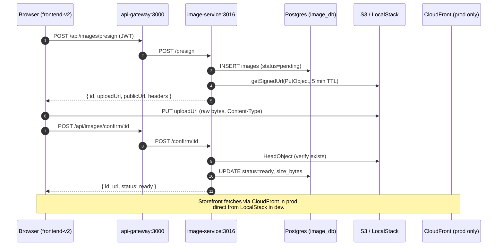

# Image pipeline

> Direct-to-S3 image uploads via presigned URLs. The API never streams the
> bytes — it only signs the request and stores metadata.

## Architecture



## Why presigned URLs?

- The API never sees the bytes → no extra hop, no memory pressure, no per-request size limits on the gateway.
- The browser uploads straight to object storage, just like Instagram/Shopify do.
- A short-lived (5 min) signed URL means stolen URLs expire quickly.
- Metadata + status live in Postgres so we can reconcile orphan objects.

## Local development

```bash
just up                                  # boots everything incl. LocalStack
curl http://localhost:3016/health        # image-service ready
aws --endpoint-url http://localhost:4566 \
    s3 ls s3://luxecart-images
```

Visit http://localhost:3001/admin/products/new (sign in as an admin first) and
drop a few images in — they upload directly to LocalStack and the resulting
`http://localhost:4566/luxecart-images/...` URL is stored on the product.

### Environment variables (image-service)

| Var | Dev value | Prod value |
| --- | --- | --- |
| `S3_ENDPOINT` | `http://localstack:4566` | _unset_ (real AWS) |
| `S3_PRESIGN_ENDPOINT` | `http://localhost:4566` | _unset_ (use CloudFront/S3) |
| `S3_BUCKET_NAME` | `luxecart-images` | e.g. `luxecart-images-prod` |
| `S3_PUBLIC_BASE_URL` | derived from endpoint | e.g. `https://cdn.luxecart.com` |
| `AWS_REGION` | `us-east-1` | `us-east-1` |
| `PRESIGN_TTL_SECONDS` | `300` | `300` |
| `MAX_UPLOAD_BYTES` | `5242880` | `5242880` |

## Production migration

1. `cd infra/terraform/envs/prod && terraform init && terraform apply`
   - Creates a **private** S3 bucket (BPA on, SSE-S3, versioning, lifecycle).
   - Creates a CloudFront distribution with OAC reading from the bucket.
   - Adds a bucket policy that only trusts that distribution's ARN.
2. Point the image-service at AWS by **unsetting** `S3_ENDPOINT` /
   `S3_PRESIGN_ENDPOINT` and setting `S3_PUBLIC_BASE_URL=https://<cdn-domain>`.
3. Give the image-service task an IAM role with `s3:PutObject`, `s3:GetObject`,
   `s3:DeleteObject`, `s3:AbortMultipartUpload` on `arn:aws:s3:::luxecart-images-prod/*`.
4. Update the frontend's CORS-allowed origins via `cors_allowed_origins` on the
   `s3-images` module.

## API

| Method | Path | Auth | Body | Returns |
| --- | --- | --- | --- | --- |
| `POST` | `/api/images/presign` | JWT | `{ contentType, ownerType, ownerId?, sizeBytes? }` | `{ id, uploadUrl, headers, publicUrl, expiresIn }` |
| `POST` | `/api/images/confirm/:id` | JWT | – | `{ id, url, sizeBytes, status }` |
| `GET` | `/api/images/public?ownerType=…&ownerId=…` | – | – | `Image[]` |
| `DELETE` | `/api/images/:id` | JWT | – | `204` |

## Failure modes

- **Browser PUT fails:** the DB row stays at `status=pending`. A nightly job
  can sweep rows older than 1 hour and delete them.
- **`/confirm` never called:** same — pending row gets garbage-collected.
- **Object deleted out-of-band:** `/confirm` returns 404 and flips the row to
  `failed`.
- **CORS error on PUT:** check `cors_allowed_origins` in the Terraform module
  (or the LocalStack bootstrap script in dev).
